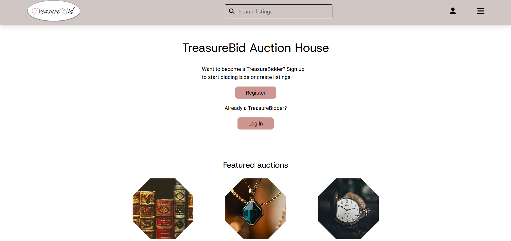

# Semester Project 2



Online Auction website

## Description

This project is an Auction website where users can register for an account and receive 1,000 credits to bid on listings.
Once logged in, users can update their profile information, create new listings, and place bids on other users’ auctions.
Unregistered visitors can still browse and view all available listings.

## Built With

- [Vite](https://vitejs.dev/) – Fast build tool and development server
- [Tailwind CSS](https://tailwindcss.com/) – Utility-first CSS framework for styling
- Vanilla JavaScript

## Getting Started

Follow these steps to set up and run the project locally:

1. **Clone the repository**

   ```bash
   git clone git@github.com:EmmaCaroline/semester-project-2.git
   ```

2. **Install dependencies**

   Ensure you have Node.js installed. Then run:

   ```bash
   npm install
   ```

3. **Start the development server**

   ```bash
   npm run dev
   ```

4. **Open the project in your browser**

   Vite will start a development server and provide a local URL (e.g., http://localhost:5173). Open this link in your browser to view the project.

5. **Build for production (optional)**

   ```bash
   npm run build
   ```
